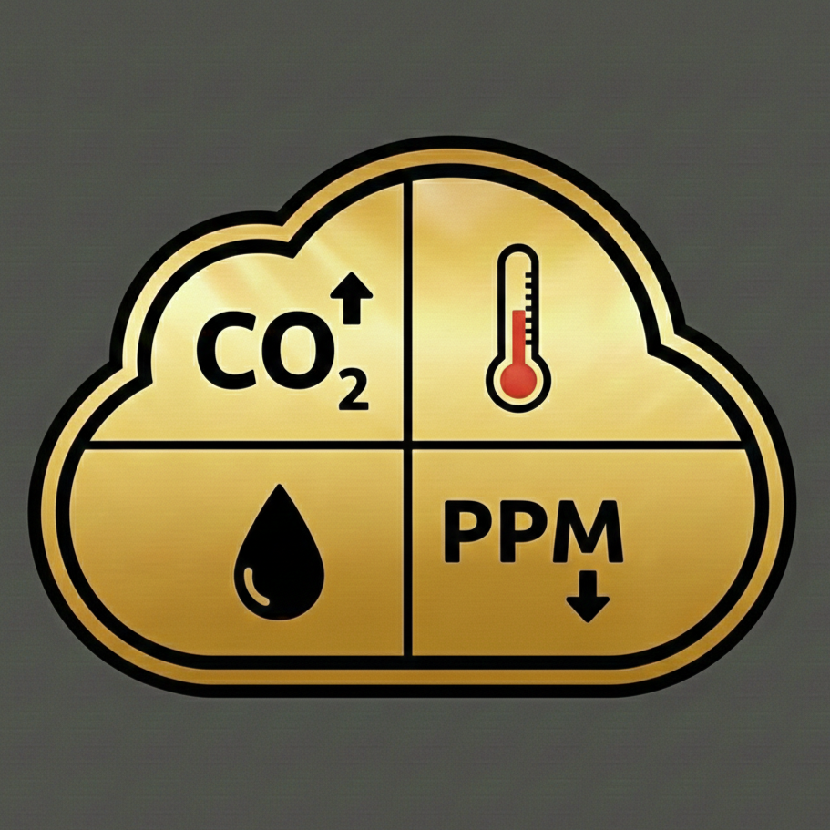

# 🏠 Indeklima - Home Assistant Integration

<p align="center">
  
</p>

[](https://github.com/custom-components/hacs)
[](https://github.com/kingpainter/indeklima)
[](LICENSE)

Advanced indoor climate monitoring for Home Assistant with multi-room support, intelligent severity scoring, trend analysis, and ventilation recommendations.

**Current Version:** 2.3.2  
**Quality Scale:** Silver Tier ⭐

---

## ✨ Features

### ✅ Implemented (v2.3.2)

#### 🪟 Window & Door Tracking
- **Indoor/Outdoor Classification** - Distinguish between outdoor windows and internal doors
- **Smart Window Detection** - Outdoor windows used for ventilation recommendations
- **Air Circulation Tracking** - Internal doors used for air circulation calculation
- **Flexible Configuration** - Easy to specify which openings lead outdoors

#### 🌬️ Air Circulation System
- **Air Circulation Sensor** - Monitor air circulation between rooms (Good/Moderate/Poor)
- **Severity Bonus** - 5% reduction in severity score with good air circulation
- **Real-time Monitoring** - See which internal doors are open
- **Room-by-room Status** - Each room shows number of open doors and windows

#### 🌡️ Climate Monitoring
- **Multi-room monitoring** - Track humidity, temperature, CO2, VOC, and formaldehyde
- **Intelligent severity scoring** - Automatic indoor climate quality calculation (0-100)
- **Multiple sensors per room** - Use multiple sensors of same type - average calculated automatically
- **Season-based thresholds** - Different limits for summer and winter

#### 📈 Trend Analysis
- **30-minute trends** - Rising/Falling/Stable for humidity, CO2, and severity
- **Historical tracking** - Automatic history with 6 data points
- **Smart alerts** - Get notified when trends are negative

#### 🌬️ Ventilation Recommendations (v2.1)
- **Smart recommendations** - Yes/No/Optional based on indoor climate and weather
- **Weather integration** - Takes outdoor temperature and humidity into account
- **Room-specific** - Shows precisely which rooms need ventilation
- **Reasoning** - Explains why you should or shouldn't ventilate

#### 🏠 Configuration & Management
- **Per-room configuration** - Add, edit, and delete rooms individually
- **Full options flow** - Manage everything after installation via UI
- **Device organization** - Modern hub + room device structure
- **Multi-language** - Danish and English support

#### 🤖 Automation Ready
- **Automation Blueprint** - Ready-made notification automation with cooldown (v2.1)
- **Dehumidifier support** - Ready for future automatic control
- **Fan/Ventilator support** - Ready for future automatic control
- **Smart cooldown** - Avoid too many notifications with last_notified tracking

#### 🔧 Technical Excellence (v2.3.1)
- **English Constants** - All code uses English, translations via JSON files
- **Per-Room Metric Sensors** - Separate temperature, humidity, CO2 sensors per room
- **Better Device Classes** - Proper HA device classes for perfect UI integration
- **Backward Compatible** - Status sensor attributes preserved for existing dashboards

### 🚧 Planned (v2.4+)
- 📱 Automatic device control (dehumidifiers, fans)
- 🎯 Diagnostics platform (Gold tier)
- 🔗 Integration with ventilation systems
- 🧠 Machine learning patterns
- ⚡ Energy optimization

---

## 📦 Installation

### Via HACS (Recommended)

1. Open HACS in Home Assistant
2. Go to "Integrations"
3. Click the three dots in top right corner
4. Select "Custom repositories"
5. Add repository URL: `https://github.com/kingpainter/indeklima`
6. Category: "Integration"
7. Click "Add"
8. Find "Indeklima" in the list and click "Download"
9. **Restart Home Assistant** (required for new integrations)

### Manual Installation

1. Download latest release from [GitHub Releases](https://github.com/kingpainter/indeklima/releases)
2. Unpack the zip file
3. Copy the entire `custom_components/indeklima` folder to your Home Assistant `config/custom_components/` directory
4. Your folder structure should be: `config/custom_components/indeklima/`
5. **Restart Home Assistant**

---

## ⚙️ Configuration

### Initial Setup

1. Go to **Settings** → **Devices & Services**
2. Click **+ Add Integration** (bottom right)
3. Search for "Indeklima"
4. Follow the setup wizard:
   - Give your integration a name (e.g., "Indeklima")
   - Add rooms one by one (you can add more later)
   - Select sensors for each room
   - Configure which windows/doors lead outdoors
   - Optionally select devices (dehumidifier, fan)

### Per-Room Configuration

For each room you configure, you can select:

#### Required
- **Room Name** - Give the room a descriptive name (e.g., "Living Room", "Master Bedroom")

#### Optional Sensors (Select 0 or more of each type)
- **Humidity sensors** - Average calculated automatically if multiple sensors
- **Temperature sensors** - Average calculated automatically if multiple sensors
- **CO2 sensors** - Average calculated automatically if multiple sensors
- **VOC sensors** - Average calculated automatically if multiple sensors
- **Formaldehyde sensors** - Average calculated automatically if multiple sensors

#### Window/Door Sensors
- **Window/Door sensors** - Select all windows and doors for this room
  - After selecting, you'll classify each as **Outdoor** or **Internal**
  - **Outdoor** = Leads to fresh air (windows, balcony doors)
  - **Internal** = Between rooms (bathroom door, closet door)

#### Optional Devices (Future Use)
- **Dehumidifier** - Will be used for automatic control in future versions
- **Fan/Ventilator** - Will be used for automatic control in future versions

#### Notifications
- **Notification targets** - Who should receive alerts for this room

### Window/Door Classification

**Critical for accurate air circulation and ventilation:**

After selecting window/door sensors, you specify which lead outdoors:

✅ **Mark as Outdoor (✓):**
- Living room window
- Bedroom window
- Balcony door
- Front door (if monitored)

❌ **Mark as Internal (leave unchecked):**
- Bathroom door (between rooms)
- Bedroom door (between rooms)
- Walk-in closet door (between rooms)
- Kitchen door (between rooms)

**Why this matters:**
- **Outdoor windows** → Used for ventilation recommendations
- **Internal doors** → Used for air circulation calculation
- Get this right for accurate climate monitoring!

---

## 📊 Sensors

### Hub Sensors (Global)

Located under the **Indeklima Hub** device, these sensors aggregate data from all rooms:

| Sensor Entity ID | Description | Unit | Example Value |
|-----------------|-------------|------|---------------|
| `sensor.indeklima_hub_severity_score` | Overall indoor climate quality | 0-100 | `25.5` |
| `sensor.indeklima_hub_status` | Overall status | - | `good` |
| `sensor.indeklima_hub_average_humidity` | Average across all rooms | % | `55.2` |
| `sensor.indeklima_hub_average_temperature` | Average across all rooms | °C | `21.3` |
| `sensor.indeklima_hub_average_co2` | Average across all rooms | ppm | `850` |
| `sensor.indeklima_hub_average_voc` | Average across all rooms | ppb | `120` |
| `sensor.indeklima_hub_average_formaldehyde` | Average across all rooms | µg/m³ | `45` |
| `sensor.indeklima_hub_open_windows` | Number of open OUTDOOR windows | count | `2` |
| `sensor.indeklima_hub_air_circulation` | Air circulation status | - | `moderate` |
| `sensor.indeklima_hub_humidity_trend` | 30-minute humidity trend | - | `stable` |
| `sensor.indeklima_hub_co2_trend` | 30-minute CO2 trend | - | `rising` |
| `sensor.indeklima_hub_severity_trend` | 30-minute severity trend | - | `stable` |
| `sensor.indeklima_hub_ventilation_recommendation` | Should you ventilate? | - | `yes` |

### Room Sensors (Per Room)

For each configured room, you get a dedicated device with multiple sensors:

#### Status Sensor (Always Present)
**Example:** `sensor.indeklima_living_room_status`

**State:** `good` / `warning` / `critical`

**Attributes (backward compatible):**
```yaml
humidity: 55.5                    # Average if multiple sensors
humidity_sensors_count: 2         # Number of sensors used
temperature: 21.3
temperature_sensors_count: 1
co2: 850
co2_sensors_count: 1
voc: 120
voc_sensors_count: 1
formaldehyde: 45
formaldehyde_sensors_count: 1
outdoor_windows_open: 0           # Number of outdoor windows open
internal_doors_open: 1            # Number of internal doors open
air_circulation_bonus: true       # Has 5% severity bonus
last_notified: "2025-01-18T14:30:00+00:00"  # For cooldown tracking
```

#### Per-Room Metric Sensors (v2.3.0+)

If the room has sensors configured, you also get separate metric sensors:

**Temperature Sensor:**  
`sensor.indeklima_living_room_temperature`
- State: `21.3` °C
- Device class: `temperature`
- Attributes: `sensors_used: 2`

**Humidity Sensor:**  
`sensor.indeklima_living_room_humidity`
- State: `55.5` %
- Device class: `humidity`
- Attributes: `sensors_used: 2`

**CO2 Sensor:**  
`sensor.indeklima_living_room_co2`
- State: `850` ppm
- Device class: `carbon_dioxide`
- Attributes: `sensors_used: 1`

**Benefits of separate sensors:**
- Use directly in automations (numeric_state triggers)
- Better graphs in HA (correct device classes)
- Voice assistant compatible ("Alexa, what's the temperature in the living room?")
- Long-term statistics automatically tracked

---

## 🌬️ Air Circulation (v2.2+)

### Understanding Air Circulation

The air circulation feature monitors how well air flows between your rooms based on **internal doors** being open.

**How it works:**
1. You classify each door/window as **Outdoor** or **Internal** during setup
2. Indeklima counts how many **internal doors** are currently open
3. Air circulation status is calculated:
   - **Good** (3+ internal doors open) → Green icon
   - **Moderate** (1-2 internal doors open) → Orange icon
   - **Poor** (0 internal doors open) → Red icon

**Severity Bonus:**
- Good air circulation gives **5% reduction** in severity score
- Better air distribution = lower risk of local climate problems
- Encourages keeping internal doors open when appropriate

### Air Circulation Sensor

**Entity:** `sensor.indeklima_hub_air_circulation`

**States:** `good` / `moderate` / `poor`

**Attributes:**
```yaml
internal_doors_open: 2
rooms_with_open_doors: "Living Room, Bathroom"
```

### Dashboard Example

```yaml
type: custom:mushroom-template-card
primary: |
  
  
    🌬️ Good Air Circulation
  
    🌀 Moderate Air Circulation
  
    🚪 Poor Air Circulation - Open Doors
  
secondary: |
  {{ state_attr('sensor.indeklima_hub_air_circulation', 'internal_doors_open') }} internal doors open
  
  
  
  Rooms: {{ rooms }}
  
icon: |
  
  mdi:fan
  mdi:fan-speed-2
  mdi:fan-off
icon_color: |
  
  green
  orange
  red
```

---

## 🌬️ Ventilation Recommendations (v2.1+)

### How Ventilation Recommendations Work

The ventilation recommendation sensor analyzes **both** indoor climate AND outdoor weather to give smart ventilation advice.

**Decision Process:**

1. **Check Outdoor Windows**
   - Already open? → Status: `optional` (you're already ventilating)

2. **Analyze Indoor Climate**
   - Humidity > max threshold? → Problem detected
   - CO2 > max threshold? → Problem detected
   - VOC > max threshold? → Problem detected

3. **Check Weather (if configured)**
   - Temperature < 5°C? → `optional` (too cold, your choice)
   - Outdoor humidity > indoor max? → `no` (will make it worse)
   - Otherwise → `yes` (good conditions)

4. **Final Recommendation**
   - Problems + Good weather = `yes` ✅
   - Problems + Bad weather = `no` ❌
   - No problems = `no` (not needed)

### Ventilation Sensor

**Entity:** `sensor.indeklima_hub_ventilation_recommendation`

**States:** `yes` / `no` / `optional`

**Attributes:**
```yaml
reason: "High humidity, High CO2"        # Why this recommendation
rooms: "Living Room, Kitchen"            # Which rooms need ventilation
outdoor_temperature: 12.5                # Current outdoor temp (if configured)
outdoor_humidity: 65                     # Current outdoor humidity (if configured)
```

### Real-World Examples

**Example 1: Should Ventilate**
```yaml
state: yes
reason: "High humidity, High CO2"
rooms: "Living Room, Bedroom"
outdoor_temperature: 15.0
outdoor_humidity: 55
```
**Interpretation:** Indoor climate is poor (high humidity AND CO2), outdoor conditions are good (15°C, 55% humidity). **Open windows now!**

**Example 2: Should NOT Ventilate**
```yaml
state: no
reason: "High humidity, Too humid outside"
rooms: "Bathroom"
outdoor_temperature: 18.0
outdoor_humidity: 75
```
**Interpretation:** Bathroom has high humidity, BUT outdoor air is also very humid (75%). Opening windows won't help. **Use dehumidifier instead.**

**Example 3: Optional**
```yaml
state: optional
reason: "Windows already open"
rooms: "None specific"
outdoor_temperature: 12.0
outdoor_humidity: 60
```
**Interpretation:** Outdoor windows are already open, so you're already ventilating. Keep monitoring.

### Dashboard Example

```yaml
type: custom:mushroom-template-card
primary: |
  
  
    🌬️ Ventilate Now!
  
    🤔 Optional - Your Choice
  
    ⏳ Wait to Ventilate
  
secondary: |
  {{ state_attr('sensor.indeklima_hub_ventilation_recommendation', 'reason') }}
  
  
  
  **Rooms:** {{ rooms }}
  
  
  
  
  
  Outdoor: {{ temp }}°C, {{ hum }}%
  
icon: |
  
  mdi:window-open-variant
  mdi:window-open
  mdi:window-closed
icon_color: |
  
  green
  orange
  red
multiline_secondary: true
```

---

## 🔔 Notifications (v2.1+)

### Automation Blueprint

Indeklima includes a ready-made automation blueprint for smart per-room notifications.

**Features:**
- ✅ Per-room configuration
- ✅ Smart cooldown (avoid notification spam)
- ✅ Time control (only during waking hours)
- ✅ Severity threshold (only Warning or Critical)
- ✅ Includes ventilation tips
- ✅ Compatible with v2.3.1+ (English constants)

### Installation

**Step 1: Copy Blueprint File**
```
Copy: blueprints/automation/indeklima/room_notification_v2.3.1.yaml
To: config/blueprints/automation/indeklima/room_notification.yaml
```

**Step 2: Reload Blueprints**
1. Go to: **Settings** → **Automations & Scenes** → **Blueprints**
2. Click **⋮** (top right) → **Reload blueprints**

**Step 3: Create Automation**
1. Click **+ Create Automation**
2. Select **"Use a blueprint"**
3. Find **"Indeklima - Rum Notifikation (v2.3.1)"**
4. Configure:

**Configuration Options:**
- **Rum Sensor** - Select the room status sensor (e.g., `sensor.indeklima_living_room_status`)
- **Notifikations Service** - Your notification service (e.g., `notify.mobile_app_your_phone`)
- **Alvorligheds Tærskel** - When to notify:
  - **Advarsel** (Warning) - Notify at Warning OR Critical
  - **Dårlig** (Critical) - Notify ONLY at Critical
- **Cooldown Timer** - Hours between notifications (default: 2 hours)
- **Aktiv Fra** - Start time (default: 09:00)
- **Aktiv Til** - End time (default: 21:00)
- **Inkluder Ventilations Tip** - Add ventilation advice to message (default: yes)

### Example Notification

```
🏠 Indeklima: Living Room
Status: Advarsel

🌡️ Fugtighed: 62%
💨 CO2: 1200 ppm
🌡️ Temperatur: 22.5°C

💡 Ventilation: Ja
High humidity, High CO2
```

### Troubleshooting Notifications

**Problem:** Not receiving notifications

**Check:**
1. Verify notification service is correct
2. Check automation is enabled
3. Look at automation traces: Settings → Automations → [Your automation] → Traces
4. Verify cooldown hasn't been triggered recently

**Problem:** Getting too many notifications

**Increase cooldown:**
1. Edit automation
2. Increase "Cooldown Timer" (e.g., from 2 to 4 hours)

**Problem:** Getting notifications at night

**Adjust time window:**
1. Edit automation
2. Change "Aktiv Fra" and "Aktiv Til" times

---

## 🎨 Dashboard Examples

### Complete Indoor Climate Dashboard

```yaml
type: vertical-stack
cards:
  # Header
  - type: custom:mushroom-title-card
    title: 🏠 Indoor Climate Status
    subtitle: v2.3.2
  
  # Overall Status Card
  - type: horizontal-stack
    cards:
      - type: custom:mushroom-entity-card
        entity: sensor.indeklima_hub_severity_score
        name: Severity Score
        icon: mdi:alert-decagram
        icon_color: |
          
          green
          orange
          red
      
      - type: custom:mushroom-entity-card
        entity: sensor.indeklima_hub_status
        name: Overall Status
        icon: mdi:home-thermometer
  
  # Air Circulation Card
  - type: custom:mushroom-template-card
    primary: |
      
      🌬️ Good Air Circulation
      🌀 Moderate Air Circulation
      🚪 Poor Air Circulation
    secondary: |
      {{ state_attr('sensor.indeklima_hub_air_circulation', 'internal_doors_open') }} internal doors open
      
      
      
      Rooms: {{ rooms }}
      
    icon: mdi:fan
    icon_color: |
      
      green
      orange
      red
    multiline_secondary: true
  
  # Ventilation Recommendation
  - type: custom:mushroom-template-card
    primary: |
      
      🌬️ Ventilate Now!
      🤔 Consider Ventilating
      ⏳ Wait to Ventilate
    secondary: |
      {{ state_attr('sensor.indeklima_hub_ventilation_recommendation', 'reason') }}
      
      
      
      **Rooms:** {{ rooms }}
      
    icon: mdi:window-open-variant
    icon_color: |
      
      green
      orange
      red
    multiline_secondary: true
  
  # Windows Status
  - type: entities
    title: 🪟 Windows & Doors
    entities:
      - entity: sensor.indeklima_hub_open_windows
        name: Outdoor Windows Open
        icon: mdi:window-open
      - type: attribute
        entity: sensor.indeklima_hub_open_windows
        attribute: rooms
        name: Rooms with open windows
  
  # Averages
  - type: entities
    title: 📊 Average Values
    entities:
      - sensor.indeklima_hub_average_humidity
      - sensor.indeklima_hub_average_temperature
      - sensor.indeklima_hub_average_co2
  
  # Trends
  - type: entities
    title: 📈 Trends (30 min)
    entities:
      - sensor.indeklima_hub_humidity_trend
      - sensor.indeklima_hub_co2_trend
      - sensor.indeklima_hub_severity_trend
```

### Per-Room Card with Metric Sensors

```yaml
type: entities
title: 🏠 Living Room Climate
entities:
  - entity: sensor.indeklima_living_room_status
    name: Status
  - type: divider
  - entity: sensor.indeklima_living_room_temperature
    name: Temperature
  - entity: sensor.indeklima_living_room_humidity
    name: Humidity
  - entity: sensor.indeklima_living_room_co2
    name: CO2
  - type: divider
  - type: attribute
    entity: sensor.indeklima_living_room_status
    attribute: outdoor_windows_open
    name: Outdoor Windows Open
  - type: attribute
    entity: sensor.indeklima_living_room_status
    attribute: internal_doors_open
    name: Internal Doors Open
```

### History Graph Card

```yaml
type: history-graph
title: 📈 Living Room - Last 24 Hours
entities:
  - entity: sensor.indeklima_living_room_temperature
    name: Temperature
  - entity: sensor.indeklima_living_room_humidity
    name: Humidity
  - entity: sensor.indeklima_living_room_co2
    name: CO2
hours_to_show: 24
refresh_interval: 0
```

### Grid of Room Cards

```yaml
type: grid
columns: 2
square: false
cards:
  - type: custom:mushroom-entity-card
    entity: sensor.indeklima_living_room_temperature
    name: Living Room
    icon: mdi:thermometer
    
  - type: custom:mushroom-entity-card
    entity: sensor.indeklima_bedroom_temperature
    name: Bedroom
    icon: mdi:bed
    
  - type: custom:mushroom-entity-card
    entity: sensor.indeklima_kitchen_temperature
    name: Kitchen
    icon: mdi:fridge
    
  - type: custom:mushroom-entity-card
    entity: sensor.indeklima_bathroom_temperature
    name: Bathroom
    icon: mdi:shower
```

---

## ⚙️ Settings

### Threshold Values

Customize threshold values to match your preferences and climate:

**Access:** Settings → Integrations → Indeklima → Configure → ⚙️ Thresholds

| Parameter | Range | Default (Summer/Winter) | Notes |
|-----------|-------|------------------------|-------|
| **Max Humidity Summer** | 40-80% | 60% | Higher in summer due to outdoor conditions |
| **Max Humidity Winter** | 30-70% | 55% | Lower in winter to prevent condensation |
| **Max CO2** | 800-2000 ppm | 1000 ppm | 800 = strict, 1200 = relaxed |
| **Max VOC** | 1.0-10.0 mg/m³ | 3.0 mg/m³ | Depends on sensor sensitivity |
| **Max Formaldehyde** | 0.05-0.5 mg/m³ | 0.15 mg/m³ | WHO guideline: 0.1 mg/m³ |

**When to adjust:**
- **Stricter limits** (lower values) → More alerts, healthier air
- **Relaxed limits** (higher values) → Fewer alerts, more tolerance
- **After renovation** → Lower VOC/formaldehyde limits temporarily

### Weather Integration

Configure a weather sensor for better ventilation recommendations:

**Access:** Settings → Integrations → Indeklima → Configure → 🌤️ Weather Integration

1. Select your preferred weather entity (e.g., `weather.home`)
2. Or leave empty to use Home Assistant's default weather
3. Save

**Benefits:**
- Takes outdoor temperature into account
- Considers outdoor humidity
- Prevents bad ventilation advice (e.g., don't ventilate when it's too humid outside)

### Room Management

**Add New Room:**
1. Settings → Integrations → Indeklima → Configure
2. Select "🏠 Manage rooms"
3. Select "Add new room"
4. Configure sensors and devices
5. Save

**Edit Existing Room:**
1. Settings → Integrations → Indeklima → Configure
2. Select "🏠 Manage rooms"
3. Select room name to edit
4. Update configuration
5. Save (integration will reload automatically)

**Delete Room:**
1. Settings → Integrations → Indeklima → Configure
2. Select "🏠 Manage rooms"
3. Select "Delete [Room Name]"
4. Confirm (this removes all sensors for that room)

---

## 🔧 Troubleshooting

### Sensors Show "Unknown" or "Unavailable"

**Problem:** Sensor displays "unknown" or "unavailable" instead of a value

**Possible Causes:**
1. Underlying sensor is unavailable
2. Sensor doesn't return numeric value
3. Integration hasn't updated yet

**Solution:**
1. **Check underlying sensors:**
   - Go to: **Developer Tools** → **States**
   - Search for your sensor (e.g., `sensor.living_room_humidity`)
   - Verify it shows a numeric value (not "unknown" or "unavailable")
   
2. **Check sensor configuration:**
   - Settings → Integrations → Indeklima → Configure → Manage rooms
   - Edit the affected room
   - Verify correct sensors are selected
   
3. **Check logs:**
   - Settings → System → Logs
   - Filter on "indeklima"
   - Look for errors like "ValueError" or "TypeError"
   
4. **Force update:**
   - Restart Home Assistant
   - Wait 5 minutes for coordinator to update
   
5. **Still broken?**
   - Try removing and re-adding the room
   - Check that sensor entity ID hasn't changed

### Window/Door Status Wrong

**Problem:** Windows show as closed when they're actually open (or vice versa)

**Solution:**

1. **Verify sensor state:**
   - Go to: **Developer Tools** → **States**
   - Find your window sensor (e.g., `binary_sensor.living_room_window`)
   - Check current state:
     - `on` = Open ✅
     - `off` = Closed ✅
     - If reversed, your sensor uses non-standard states

2. **Check sensor type:**
   - Indeklima expects **binary_sensor** entities
   - State must be `on` or `off`
   - Some sensors use `open`/`closed` instead (won't work)

3. **Fix reversed sensors:**
   - If your sensor reports `off` when open and `on` when closed
   - Create a template sensor to reverse it:
   
   ```yaml
   # configuration.yaml
   template:
     - binary_sensor:
         - name: "Living Room Window Fixed"
           state: >
             {{ is_state('binary_sensor.living_room_window', 'off') }}
           device_class: window
   ```
   
4. **Use the fixed sensor:**
   - Settings → Integrations → Indeklima → Configure
   - Edit room → Select the new "Fixed" sensor

### Air Circulation Always Shows "Poor"

**Problem:** Even with doors open, air circulation shows "Poor"

**Causes:**
1. Doors are marked as "Outdoor" instead of "Internal"
2. Door sensors aren't reporting correctly
3. No door sensors configured at all

**Solution:**

1. **Verify door classification:**
   - Settings → Integrations → Indeklima → Configure
   - Select "🏠 Manage rooms"
   - Edit each room with doors
   - Click through to window/door configuration
   - **Internal doors should NOT have checkmark** (not outdoor)

2. **Check door sensor states:**
   - Developer Tools → States
   - Find door sensors
   - Verify they show `on` when open

3. **Expected behavior:**
   - 0 internal doors open = `poor`
   - 1-2 internal doors open = `moderate`
   - 3+ internal doors open = `good`

4. **Example setup:**
   ```
   Living Room:
     - Living room window → ✓ Outdoor
     - Living room balcony door → ✓ Outdoor
     - Living room to hallway door → ✗ Internal
   
   Bathroom:
     - Bathroom window → ✓ Outdoor
     - Bathroom door → ✗ Internal
   ```

### Ventilation Recommendation Doesn't Work

**Problem:** Sensor always shows "No" or "unknown"

**Solution:**

1. **Check room configuration:**
   - At least ONE room must have sensors configured
   - Verify rooms have humidity or CO2 sensors

2. **Configure weather entity:**
   - Settings → Integrations → Indeklima → Configure
   - Select "🌤️ Weather Integration"
   - Choose your weather entity
   - Without weather, recommendations are basic

3. **Verify thresholds:**
   - Settings → Integrations → Indeklima → Configure
   - Select "⚙️ Thresholds"
   - Check values are reasonable
   - If thresholds are too high, you'll never trigger recommendations

4. **Check sensor attributes:**
   - Developer Tools → States
   - Find: `sensor.indeklima_hub_ventilation_recommendation`
   - Look at attributes for "reason"
   - This explains why recommendation is what it is

5. **Expected behavior:**
   - `no` = Indoor climate is OK, or outdoor conditions are bad
   - `yes` = Indoor climate has problems AND outdoor conditions are good
   - `optional` = Windows already open, or borderline conditions

### New Sensors Not Appearing After Adding Room

**Problem:** Created new room but sensors don't appear

**Solution:**

1. **Restart Home Assistant:**
   - Settings → System → Restart
   - New sensors require restart to appear

2. **Check device registry:**
   - Settings → Devices & Services → Devices
   - Search for "Indeklima"
   - Find your new room device
   - Click it to see all sensors

3. **Verify room has sensors configured:**
   - If room has NO sensors of any type
   - Only status sensor will be created
   - Add at least temperature, humidity, or CO2 sensors

4. **Check for errors:**
   - Settings → System → Logs
   - Filter on "indeklima"
   - Look for errors mentioning the room name

### Automations Not Triggering

**Problem:** Created automation but not receiving notifications

**Solution:**

1. **Check automation is enabled:**
   - Settings → Automations & Scenes
   - Find your automation
   - Verify it has no warning icon

2. **Check trigger conditions:**
   - Edit automation
   - Verify room status sensor is correct
   - Check time window (Aktiv Fra/Til)
   - Verify severity threshold

3. **Check cooldown:**
   - Look at room status sensor attributes
   - Check `last_notified` timestamp
   - If recently notified, cooldown prevents spam

4. **Test manually:**
   - Edit automation
   - Click "Run" (play button top right)
   - Should trigger immediately if conditions met

5. **View traces:**
   - Automation page → Your automation
   - Click "Traces" tab
   - See exactly why automation didn't trigger

### Duplicate Devices After Upgrade

**Problem:** Multiple "Indeklima" devices with same rooms

**Cause:** This was a bug in v2.3.0 (encoding issue)

**Solution:**

1. **If on v2.3.0:**
   - Upgrade to v2.3.1 or v2.3.2 (fixes encoding)
   
2. **Remove duplicates:**
   - Settings → Devices & Services → Integrations
   - Remove ALL Indeklima entries
   - Restart Home Assistant
   - Re-add Indeklima integration (now with v2.3.1+)
   
3. **Prevention:**
   - Always use v2.3.1 or newer
   - Don't downgrade to v2.3.0

### High Severity Score But Everything Looks Fine

**Problem:** Severity shows 60+ but all values seem normal

**Solution:**

1. **Check ALL metrics:**
   - Not just the main ones
   - Look at VOC and formaldehyde too
   - One high value can spike severity

2. **Verify thresholds:**
   - Settings → Configure → Thresholds
   - Ensure they match your sensors and preferences
   - Default thresholds might not suit your situation

3. **Understand severity calculation:**
   ```
   Severity = 0-100 (lower is better)
   - Humidity excess: 0-30 points
   - CO2 excess: 0-30 points
   - VOC excess: 0-20 points
   - Formaldehyde excess: 0-20 points
   - Air circulation bonus: -5% if good
   ```

4. **Check room-by-room:**
   - Look at each room's status sensor
   - Find which room(s) are causing high severity
   - Focus on fixing those specific rooms

---

## 📝 Changelog

See [CHANGELOG.md](CHANGELOG.md) for full version history.

### v2.3.2 (2025-01-18) - CURRENT
- 📚 **Documentation Updates** - Improved accuracy and clarity
- ✅ Enhanced troubleshooting section
- ✅ Better configuration examples
- ✅ Improved dashboard examples
- ✅ More detailed sensor explanations

### v2.3.1 (2025-01-18)
- 🔧 **Complete Encoding Cleanup** - All English constants
- ✅ Fixed Danish character handling (æ, ø, å)
- ✅ State translations via strings.json/da.json
- ✅ Blueprint fixed for v2.3.1

### v2.3.0 (2025-01-12)
- 📊 Per-room metric sensors (temperature, humidity, CO2)
- ✅ Better device classes
- ✅ Backward compatible attributes

### v2.2.0 (2025-01-12)
- 🪟 Indoor/Outdoor window classification
- 🌬️ Air circulation sensor
- 🎯 Severity bonus for good air circulation
- ✅ Fixed window state logic

### v2.1.0 (2025-01-11)
- 🌬️ Ventilation recommendations
- 📱 Automation Blueprint
- 🔔 Last notified tracking

### v2.0.0 (2025-01-04)
- 🏠 Device organization
- ✨ Modern entity naming
- 📈 Trend analysis

### v1.0.0 (2025-01-02)
- 🎉 Initial release

---

## 🤝 Contributing

Contributions are very welcome!

1. Fork the project on GitHub
2. Create a feature branch (`git checkout -b feature/AmazingFeature`)
3. Commit your changes (`git commit -m 'Add some AmazingFeature'`)
4. Push to your branch (`git push origin feature/AmazingFeature`)
5. Open a Pull Request

**Before contributing:**
- Read the code standards in project documentation
- Test your changes thoroughly
- Update documentation if needed
- Follow Home Assistant coding guidelines

---

## 📄 License

This project is licensed under the MIT License - see [LICENSE](LICENSE) file for details.

---

## 🙏 Acknowledgements

- Home Assistant community for support and inspiration
- HACS team for making custom integrations easy
- All users who report issues and suggest improvements
- Contributors who help improve the code

---

## 📞 Support

Need help? Here's where to get it:

- **Issues:** [GitHub Issues](https://github.com/kingpainter/indeklima/issues) - Bug reports and feature requests
- **Discussions:** [GitHub Discussions](https://github.com/kingpainter/indeklima/discussions) - General questions and ideas
- **Documentation:** [GitHub Wiki](https://github.com/kingpainter/indeklima/wiki) - Extended guides and tutorials

**Before creating an issue:**
1. Check existing issues (open and closed)
2. Review troubleshooting section above
3. Check Home Assistant logs
4. Provide relevant details (version, configuration, logs)

---

**Made with ❤️ by KingPainter**

**Star ⭐ this repo if you find it useful!**
