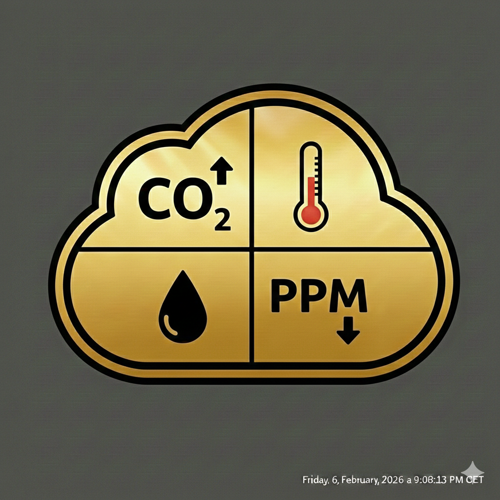

# 🏠 Indeklima - Home Assistant Integration

<p align="center">
  
</p>

[](https://github.com/custom-components/hacs)
[](https://github.com/kingpainter/indeklima)
[](LICENSE)
[](https://developers.home-assistant.io/docs/integration_quality_scale)

Advanced indoor climate monitoring for Home Assistant with multi-room support, intelligent severity scoring, trend analysis, ventilation recommendations, and a built-in sidebar panel.

**Current Version:** 2.4.1
**Quality Scale:** Silver Tier ⭐ (approaching Gold)

---

## ✨ Features

### 🌡️ Climate Monitoring
- **Multi-room monitoring** — Humidity, temperature, CO2, VOC, formaldehyde, and pressure
- **Intelligent severity scoring** — 0–100 score per room and globally
- **Multiple sensors per room** — Average calculated automatically across sensors
- **Season-based thresholds** — Different humidity limits for summer and winter
- **Pressure sensor support** — Informational only, does not affect severity score

### 📈 Trend Analysis
- **30-minute rolling window** — Rising/Falling/Stable for humidity, CO2, and severity
- **Linear regression** — Slope-based trend detection, not just point-to-point

### 🪟 Window & Door Tracking
- **Indoor/Outdoor classification** — Outdoor windows vs. internal doors
- **Air circulation monitoring** — Good/Moderate/Poor based on open internal doors
- **Severity bonus** — 5% reduction when air circulation is good
- **Ventilation recommendations** — Yes/No/Optional based on indoor climate + weather

### 🖥️ Built-in Panel
- **Sidebar panel** — Live overview, per-room details, ventilation tab
- **Three tabs** — Overview, Rooms, Ventilation
- **Session cache** — Instant load from cache while fresh data fetches
- **Skeleton loader** — Smooth first-load experience

### 🔧 Integration Quality
- **Diagnostics** — Download full diagnostics from Settings → Devices & Services
- **System health** — Appears in Settings → System → System information
- **Repair flow** — Actionable issues in Settings → System → Repairs for unavailable sensors and coordinator failures
- **Error handling** — `ConfigEntryNotReady` on startup, `UpdateFailed` on update cycle
- **Unit tests** — Full test suite in `tests/`

### 🤖 Automation Ready
- **Automation Blueprint** — Ready-made notification automation with cooldown
- **18 hub sensors** — All accessible in automations and dashboards
- **Per-room metric sensors** — Separate HA entities per room for temperature, humidity, CO2, pressure

---

## 📦 Installation

### Via HACS (Recommended)

1. Open HACS in your Home Assistant
2. Go to **Integrations**
3. Click the three dots (⋮) → **Custom repositories**
4. Add `https://github.com/kingpainter/indeklima` as type **Integration**
5. Search for **Indeklima** and install
6. Restart Home Assistant
7. Go to **Settings → Devices & Services → Add Integration** → search for **Indeklima**

### Manual

1. Copy `custom_components/indeklima/` to your HA `custom_components/` folder
2. Restart Home Assistant
3. Add the integration via **Settings → Devices & Services**

---

## ⚙️ Configuration

Indeklima is configured entirely through the UI — no YAML required.

**Setup:** Settings → Devices & Services → Add Integration → Indeklima

**Per room you can configure:**
- Humidity sensors
- Temperature sensors
- CO2 sensors
- VOC sensors
- Formaldehyde sensors
- Pressure sensors (informational)
- Window and door sensors (outdoor/indoor classification)

**Options (after setup):**
- Humidity thresholds (summer/winter)
- CO2, VOC, formaldehyde thresholds
- Weather entity for ventilation recommendations
- Add, edit, or delete rooms

---

## 🏗️ Architecture

```
Physical Sensors → HA States → IndeklimaDataCoordinator
    ├── Calculates averages
    ├── Calculates severity scores (0–100)
    ├── Tracks 30-minute trends
    ├── Checks ventilation conditions
    └── Updates coordinator.data
        ↓
Sensor Entities (18 hub + per-room)
        ↓
WebSocket API → Sidebar Panel
```

**Severity scoring:**
| Metric | Max points |
|---|---|
| Humidity | 30 |
| CO2 | 30 |
| VOC | 20 |
| Formaldehyde | 20 |
| Pressure | 0 (informational only) |
| Air circulation bonus | −5% |

**Status thresholds:**
| Score | Status |
|---|---|
| 0–29 | ✅ Good |
| 30–59 | ⚠️ Warning |
| 60–100 | 🔴 Critical |

---

## 🩺 Diagnostics & Repairs

**Download diagnostics:**
Settings → Devices & Services → Indeklima → ⋮ → Download diagnostics

**System health:**
Settings → System → Repairs → ⋮ → System information → scroll to Indeklima

**Repairs dashboard:**
Settings → System → Repairs

Repair issues are raised automatically when:
- A configured sensor entity becomes unavailable
- The coordinator fails to fetch data

Issues clear automatically when the problem resolves.

---

## 🧪 Running Tests

```bash
pip install -r requirements_test.txt
pytest --cov=custom_components/indeklima --cov-report=term-missing
```

---

## 📋 Changelog

| Version | Highlights |
|---|---|
| **2.4.1** | Repair flow, unit tests, panel scroll fix, weather display fix, `__version__` source of truth fix |
| 2.4.0 | Diagnostics, system health, setup failure handling, sidebar panel, WebSocket API |
| 2.3.3 | Pressure sensor support |
| 2.3.2 | Documentation improvements |
| 2.3.1 | English constants, encoding cleanup |
| 2.3.0 | Per-room metric sensors |
| 2.2.0 | Air circulation system |
| 2.1.0 | Ventilation recommendations, automation blueprint |
| 2.0.0 | Device organisation, modern naming, trend analysis |

Full changelogs: see `CHANGELOG_v2_4_1.md` and `CHANGELOG_v2_4_0.md`.

---

## 🤝 Contributing

1. Fork the project
2. Create a feature branch (`git checkout -b feature/my-feature`)
3. Commit your changes (`git commit -m 'feat: add my feature'`)
4. Push to your branch (`git push origin feature/my-feature`)
5. Open a Pull Request

**Before contributing:**
- Follow Home Assistant coding guidelines
- Run the test suite and ensure it passes
- Update documentation and translations if needed
- English in all code; Danish translations in `translations/da.json`

---

## 📄 License

MIT License — see [LICENSE](LICENSE) for details.

---

## 📞 Support

- **Bugs & feature requests:** [GitHub Issues](https://github.com/kingpainter/indeklima/issues)
- **Questions:** [GitHub Discussions](https://github.com/kingpainter/indeklima/discussions)

**Before opening an issue:** check HA logs, download diagnostics, include your version number.

---

**Made with ❤️ by KingPainter — Star ⭐ if you find it useful!**
